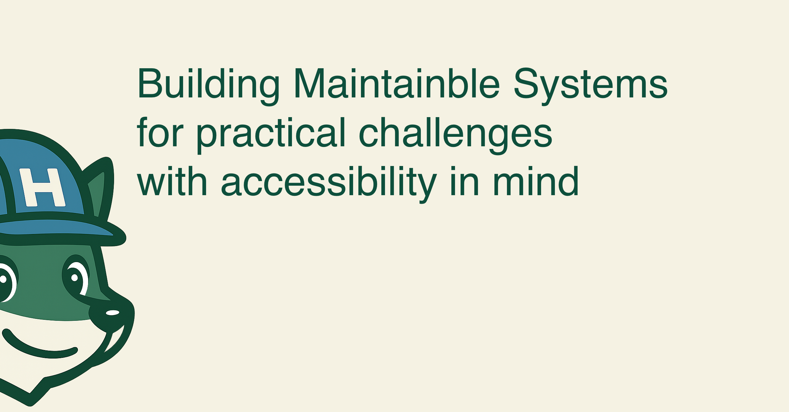

5+ years with React, TypeScript, and component architecture. ASL fluent, focused on inclusive design that works for everyone.

## Professional Highlights
**Component Architecture:** 1 → 50+ production components  
**Technical Mentorship:** 12+ engineers supported, 1 promoted to Senior  
**Platform Impact:** Systems supporting 60% year-over-year growth  
**Technology Leadership:** Led TypeScript adoption across frontend teams  

---

[lawrencehorne.com](https://lawrencehorne.com)  

*Building bridges between complex technology and inclusive user experiences* 🦊
